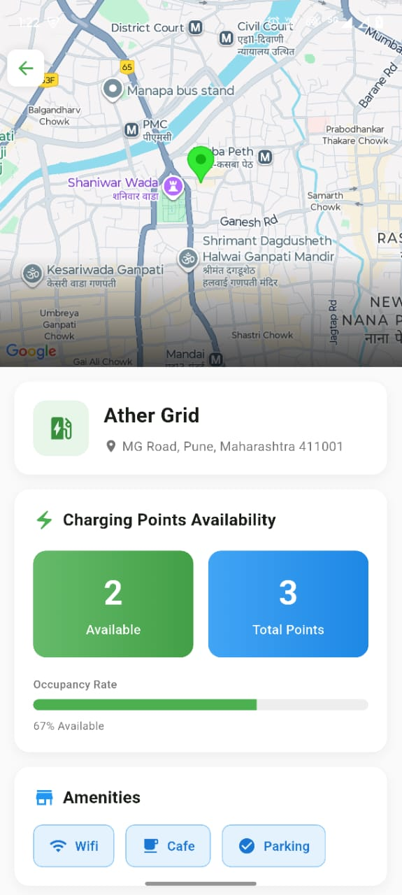
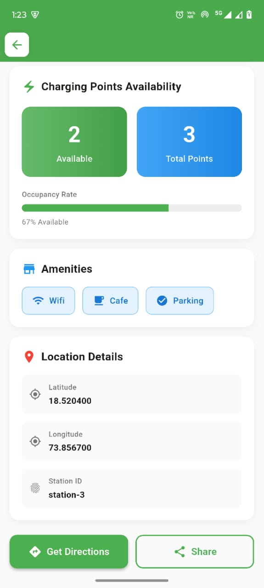

EV Charging Station Finder
A Flutter application that helps users find and view EV charging stations with real-time availability, Google Maps integration, and Firebase authentication.
Features

User Authentication: Google Sign-In integration using Firebase Auth
Station Discovery: Browse all available EV charging stations
Real-time Data: Charging point availability from Firebase Realtime Database
Interactive Maps: Google Maps integration showing station locations
Detailed Information: View station details including amenities, address, and availability
Clean Architecture: MVC pattern with GetX state management

Screenshots

Login Screen with Google Sign-In

Home Screen with station list

Station Detail Screen with Google Maps
 

Real-time availability tracking
--used realtime database which can ne updated instaltly on thtnadmin panle

Tech Stack

Framework: Flutter
State Management: GetX
Backend: Firebase

Firebase Authentication (Google Sign-In)
Firebase Realtime Database

Maps: Google Maps Flutter
Architecture: MVC Pattern
